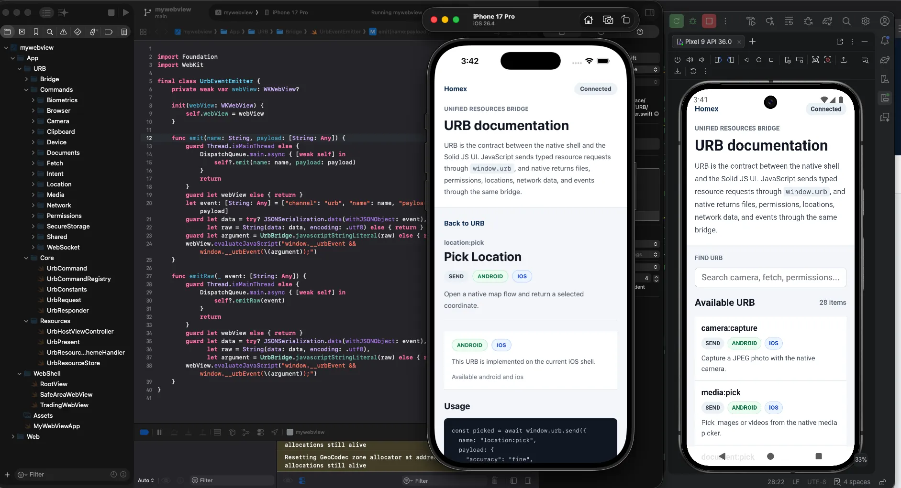

# Vue Native Hybrid



Vue Native Hybrid is a boilerplate for building mobile applications with a
shared Vue web interface and small, platform-native shells. The UI and screen
logic are written once with Vue 3 and TypeScript, then hosted inside an Android
`WebView` and an iOS `WKWebView`.

The repository contains all three application layers:

- `src/` — the shared Vue application
- `android/` — the native Android host and Android URB implementation
- `ios/` — the native iOS host and iOS URB implementation

This approach keeps screens, navigation, forms, and most product behavior
consistent across platforms while native code owns device integration such as
the camera, permissions, secure storage, biometrics, location, and networking.

## Not Another Cross-Platform Framework

This project does not add a general-purpose runtime such as React Native,
Capacitor, Cordova, or Tauri. It uses the platform WebView APIs directly:

- Android uses Kotlin, AndroidX WebKit, and `WebView`
- iOS uses Swift, SwiftUI, and `WKWebView`
- Vue owns the shared user interface
- URB provides the explicit boundary between web and native code

The result is a deliberately small architecture with direct control over the
web application, native hosts, security policy, and device APIs.

## What Is URB?

**URB** stands for **Unified Resources Bridge**. It is this project's typed
communication contract between the Vue application and the Android/iOS native
shells.

Code running in a WebView cannot safely access every device feature through
normal browser APIs. URB fills that gap. The Vue application sends a named JSON
command through `window.urb`; the native bridge validates and dispatches it to a
Kotlin or Swift command; native code then returns a result or emits an event
back to JavaScript.

```text
Vue / TypeScript
      │
      │ window.urb.send(), fire(), on()
      ▼
URB JSON message contract
      │
      ├── Android UrbBridge → Kotlin command
      └── iOS UrbBridge     → Swift command
                               │
                               ▼
                    Camera, storage, location,
                    biometrics, network, etc.
```

URB exposes four main interaction patterns:

- `window.urb.send(...)` runs a request/response command and returns a Promise.
- `window.urb.fire(...)` sends a one-way command.
- `window.urb.on(...)` and `window.urb.off(...)` subscribe to native events.
- Convenience APIs such as `window.urb.clipboard` and
  `window.urb.websocket` wrap common command sequences.

Example request:

```ts
const device = await window.urb.send({
  name: "device:info",
});

const unsubscribe = window.urb.on("network:statusChange", (status) => {
  console.log(status.connected, status.type);
});

// Remove the listener when it is no longer needed.
unsubscribe();
```

URB currently covers:

- camera capture, media selection, and document selection
- current location and native location picking
- permission inspection and requests
- external browser and native intent handling
- clipboard access
- device information
- protected storage
- biometric availability and authentication
- deep links and network status events
- native HTTP requests and WebSockets

Picked or captured files are returned to Vue as standard browser `File`
objects. Internally, native code exposes short-lived, one-time resource URLs so
large binary data does not need to be embedded in bridge JSON.

The bridge also enforces security boundaries: trusted origins, main-frame-only
messages, command-mode checks, request IDs and timeouts, restricted native
network policies, and temporary resource tokens. In an ordinary browser,
`window.urb.isAvailable()` returns `false`; native-only `send` calls reject with
`URB_UNAVAILABLE`.

For the full message format, request lifecycle, security model, and instructions
for adding commands, see [URB architecture and workflow](docs/URB.md).

## Demo

<video src="./docs/demo-pickup-location.mp4" controls width="100%"></video>

## Architecture

- **Vue 3 + TypeScript** provides the shared application UI and screen logic.
- **Vue Router** uses hash history, which works without server-side route
  rewriting inside bundled WebViews.
- **Pinia** provides shared client-side state management.
- **Tailwind CSS** provides utility-first styling.
- **Vite** serves the development app and produces the packaged web bundle.
- **Android** hosts the bundle in an Android `WebView` and implements URB in
  Kotlin.
- **iOS** hosts the same bundle in a `WKWebView` and implements URB in Swift.

At application startup, `src/main.ts` initializes URB as `window.urb`, creates
the Vue app, and installs Pinia and Vue Router.

Current application routes include:

- `/home`
- `/signin`
- `/signup`
- `/stories`
- `/stories/:story`

The Stories catalog documents and demonstrates the shared UI components and
URB commands. The root route redirects to `/home`; unknown routes display the
not-found page.

## Repository Structure

```text
.
├── android/                       # Android WebView host and Kotlin URB commands
├── docs/                          # Architecture notes and demo assets
├── ios/                           # iOS WKWebView host and Swift URB commands
├── public/                        # Static web assets
├── scripts/                       # Bun-enforcing development/build scripts
├── src/
│   ├── components/ui/             # Shared Vue UI components
│   ├── composables/               # Shared application behavior
│   ├── layouts/                   # Reusable page layouts
│   ├── lib/Urb/                   # Typed JavaScript URB client and contracts
│   ├── pages/                     # App screens and Stories catalog
│   ├── App.vue                    # Root router view
│   ├── main.ts                    # Vue and URB entry point
│   └── router.ts                  # Hash-based route registration
├── index.html                     # Vite HTML entry
├── package.json                   # Scripts and dependencies
└── vite.config.ts                 # Vue, Tailwind, aliases, tests, and dev server
```

## Development

### Prerequisites

- [Bun](https://bun.sh/)
- Python 3 (used by the development and build wrappers)
- Android Studio, Android SDK 36, and a Java 11-compatible toolchain for Android
- Xcode and the iOS SDK for iOS

This repository standardizes its frontend commands on Bun. Install
dependencies with:

```bash
bun install
```

If the scripts are not executable after cloning:

```bash
bun run allow:scripts
```

Start the Vue development server:

```bash
bun run dev
```

The web application is available at:

```text
http://localhost:8080
```

The browser build is useful for UI work. URB native commands require the app to
run inside an Android or iOS shell.

### Android

The Android entry point is:

```text
android/app/src/main/java/com/example/mywebview/app/main/MainActivity.kt
```

A debug build loads the host development server through the Android emulator:

```text
http://10.0.2.2:8080/
```

Keep `bun run dev` running, then launch the app from Android Studio or build a
debug APK:

```bash
bun run build:android
```

For a release APK:

```bash
bun run build:android:production
```

The Android Gradle build copies `dist/` into
`android/app/src/main/assets/web/`. Packaged builds serve those files through
Android's secure WebView asset loader.

### iOS

The SwiftUI application entry point is:

```text
ios/App/MyWebViewApp.swift
```

The WebView host is:

```text
ios/App/WebShell/TradingWebView.swift
```

A debug build loads:

```text
http://localhost:8080/
```

Keep `bun run dev` running and launch the `mywebview` scheme from Xcode, or run:

```bash
bun run build:ios
```

For a release build:

```bash
bun run build:ios:production
```

The Xcode project copies `dist/` into the bundled `ios/Web/` directory.

## Build, Test, and Quality Commands

```bash
bun run build              # Type-check and build the Vue web application
bun run build:web          # TypeScript project build followed by Vite
bun run test:run           # Run the Vitest suite once
bun run test:coverage      # Run tests with V8 coverage
bun run lint               # Run ESLint and TypeScript checks
bun run format:check       # Check Prettier formatting
bun run translation:check  # Validate translation usage
bun run preview            # Preview the production web bundle
```

Vite writes the production web application to `dist/`. Platform production
builds package that same output so Android and iOS run the same Vue interface.

## Extending the Project

Keep shared product UI and business-facing interactions in Vue. Add
platform-specific behavior to both native implementations when the feature
must work on Android and iOS, then expose it through the typed contract in
`src/lib/Urb/`.

When adding a URB command:

1. Define its payload and result in the TypeScript command map.
2. Implement and register the Android Kotlin command.
3. Implement and register the iOS Swift command.
4. Add result transformation when native data must become a web type such as
   `File` or `Response`.
5. Add tests and a URB story demonstrating the command and its important
   states.

This keeps the bridge explicit, testable, and consistent across both native
platforms.
