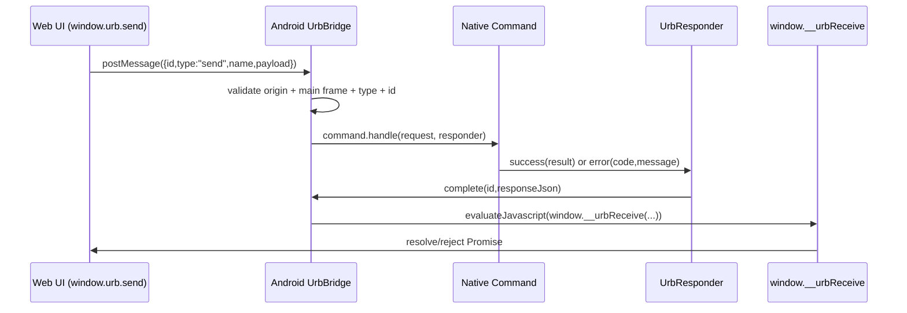
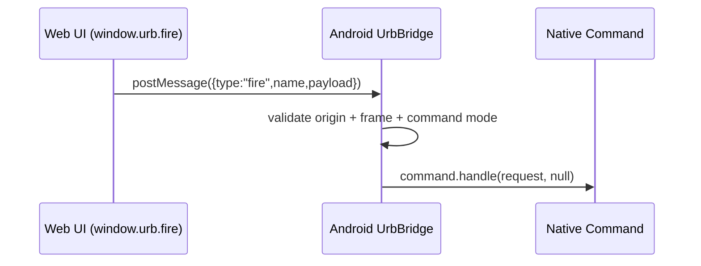
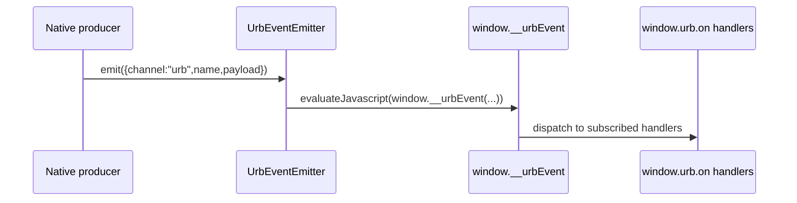
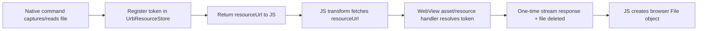

# Unified Resources Bridge (URB)

This document explains how URB works in this project, from JavaScript calls to native Android execution and back.

## 1. What URB is

URB is the communication contract between:

- Web UI: SolidJS app in `src/`
- Native shell: Android `WebView` host in `android/`

URB lets web code call native capabilities (camera, picker, permissions, secure storage, biometrics, network, deep links, etc.) through typed commands.

Core API in JavaScript:

- `window.urb.send(...)`: request-response commands
- `window.urb.fire(...)`: one-way commands
- `window.urb.on(...)` / `window.urb.off(...)`: native event stream
- `window.urb.websocket.open(...)`: high-level native websocket handle

## 2. System components

### JavaScript side (`src/native`)

- `initURB()` in [src/native/urb.ts](/Users/venobi/Workspace/my-webview/src/native/urb.ts):
  - installs `window.urb`
  - registers `window.__urbReceive` for responses
  - registers `window.__urbEvent` for events
- Type contract in [src/native/urb.types.ts](/Users/venobi/Workspace/my-webview/src/native/urb.types.ts)
- Result transforms in [src/native/urb.utils.ts](/Users/venobi/Workspace/my-webview/src/native/urb.utils.ts)
  - converts native file resource URLs into browser `File` objects

### Android side (`android/app/src/main/java/com/example/mywebview/urb`)

- `UrbBridge`:
  - receives JSON messages from WebView
  - validates origin and frame
  - dispatches to registered command handler
  - sends response back to JS
  - enforces request timeout
- `UrbCommandRegistry`:
  - maps command name to command implementation
- `UrbEventEmitter`:
  - pushes native events into web runtime
- `UrbResourceStore` + `UrbResourcePathHandler`:
  - temporary file token store
  - one-time fetchable resource path for picked/captured files

### Host wiring (`MainActivity`)

`MainActivity` builds and wires:

- all command handlers
- WebView security config
- allowed URB origins
- asset/resource path handlers

## 3. End-to-end workflow

## 3.1 `send` request-response flow



Key behavior:

- request id is generated on JS side (`createRequestId()`)
- one active response per id
- duplicate ids are rejected
- native timeout currently 60s (`URB_REQUEST_TIMEOUT`)

## 3.2 `fire` one-way flow



`fire` has no response promise. If native bridge is unavailable in web preview, selected fire commands are logged in JS fallback (`toast`, `intent:open`, `browser:open`).

## 3.3 Native event flow



Current typed events:

- `deepLink:open`
- `network:statusChange`

## 4. File/resource workflow (camera, media, documents)

When native commands return files, they return metadata + temporary `resourceUrl` instead of raw bytes in response JSON.



Important:

- token is one-time consume
- resource has TTL
- consumed/expired resources are removed
- JS should use returned `File`, not keep internal resource URL

## 5. Request envelope and response envelope

## 5.1 Request envelope (JS -> native)

```json
{
  "id": "uuid-or-generated-id",
  "type": "send",
  "name": "camera:capture",
  "payload": {}
}
```

Notes:

- `id` is required for `send`, omitted for `fire`
- `type` is `send` or `fire`
- `name` maps to registered native command

## 5.2 Response envelope (native -> JS)

Success:

```json
{
  "id": "same-request-id",
  "ok": true,
  "result": {}
}
```

Failure:

```json
{
  "id": "same-request-id",
  "ok": false,
  "error": {
    "code": "ERROR_CODE",
    "message": "Human readable message"
  }
}
```

## 6. Type contract and command catalog

Single source of JS contract:

- [src/native/urb.types.ts](/Users/venobi/Workspace/my-webview/src/native/urb.types.ts)

Categories:

- Send commands: request-response operations
- Fire commands: one-way operations
- Event map: native push events

Design pattern:

- each command has `payload` and `result` type
- `UrbSendRequest` makes payload optional only when command payload allows `undefined`

## 7. Security and policy boundaries

URB security in this project:

1. Origin allowlist:
   - bridge only accepts configured origins (`DEBUG_APP_URL` and appassets origin)
2. Main-frame only:
   - non-main-frame messages rejected
3. Command mode checks:
   - `fire` cannot call response-required commands
   - `send` requires request id and response-capable command
4. Network policy for fetch/websocket:
   - URL scheme and host checks
   - header restrictions
   - payload/response size limits
5. File resource controls:
   - tokenized, temporary, one-time retrieval

## 8. Web preview behavior vs native shell

### In native shell

- `window.urb.isAvailable()` is true
- all command routes can execute
- event streams are live

### In normal browser preview (`vite`)

- `window.urb.isAvailable()` is false
- `send` rejects with `URB_UNAVAILABLE`
- selected `fire` commands log fallback info
- docs pages should show payload/code even when run button is disabled

## 9. Lifecycle and cleanup

Native side cleanup in `MainActivity.onDestroy()`:

- cancels active fetch calls
- cancels pending location request
- cancels pending biometric prompt
- closes all websocket connections
- clears and deletes temporary resource files
- destroys WebView

This prevents resource leaks when Activity closes.

## 10. Implementation workflow for new URB command

1. Add native command class implementing `UrbCommand`
2. Register it in `MainActivity` via `UrbCommandRegistry`
3. Add type contract in `src/native/urb.types.ts`
4. Add serializer/transformer logic in `src/native/urb.ts` (if needed)
5. Add tests in `src/native/urb.test.ts` and/or contract tests
6. Add URB docs page under `src/pages/Urb/playground`

Recommended command design:

- validate payload early with clear error codes
- keep result shape stable and minimal
- map Android-specific details to typed JS contract
- provide deterministic error codes for product handling

## 11. Troubleshooting guide

If command fails from JS:

1. Check `window.urb.isAvailable()`
2. Inspect `UrbError.code` and `UrbError.message`
3. Verify command exists in `UrbCommandRegistry`
4. Verify payload shape matches `urb.types.ts`
5. For file commands, ensure resource URL is fetched once immediately

If command never resolves:

1. confirm native command calls `responder.success/error`
2. check for timeout (`URB_REQUEST_TIMEOUT`)
3. check Activity lifecycle interruption

## 12. Reference files

- JS bridge client:
  - [urb.ts](/Users/venobi/Workspace/my-webview/src/native/urb.ts)
  - [urb.types.ts](/Users/venobi/Workspace/my-webview/src/native/urb.types.ts)
  - [urb.utils.ts](/Users/venobi/Workspace/my-webview/src/native/urb.utils.ts)
- Android bridge core:
  - [UrbBridge.kt](/Users/venobi/Workspace/my-webview/android/app/src/main/java/com/example/mywebview/urb/UrbBridge.kt)
  - [UrbCommandRegistry.kt](/Users/venobi/Workspace/my-webview/android/app/src/main/java/com/example/mywebview/urb/UrbCommandRegistry.kt)
  - [UrbResourceStore.kt](/Users/venobi/Workspace/my-webview/android/app/src/main/java/com/example/mywebview/urb/UrbResourceStore.kt)
- Android host wiring:
  - [MainActivity.kt](/Users/venobi/Workspace/my-webview/android/app/src/main/java/com/example/mywebview/MainActivity.kt)
